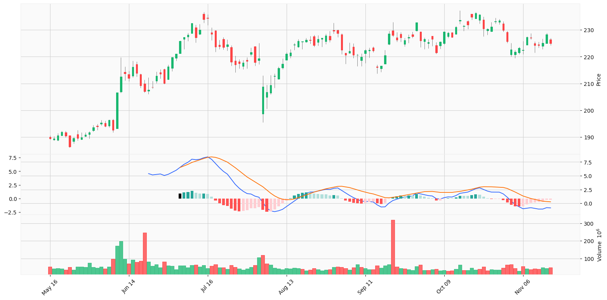

# Algorithmic Trading by Swang

Generate trading signals with simple strategies such as moving average convergence / divergence (MACD).

## Strategy: MACD + Support Resistance Level

- MACD Formula: MACD = 12-Period EMA − 26-Period EMA
- Buy signal: MACD line crosses upward signal line below zero, and current price > 200-day EMA
- Sell signal: MACD line crosses downward signal line above zero

## References
- [What Is MACD?](https://www.investopedia.com/terms/m/macd.asp)
